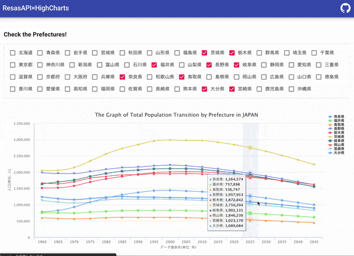

# The Graph of Total Population Transition by Prefecture



## About

[React×ResasAPI×Highcharts](https://github.com/nadjaharold/react-resas-highcharts)を TypeScript に書き換えてみた。
Reactほとんど書いたことないのでエラー取るのに結構苦戦。Vue,Nuxtから移行すべくじわじわ使っていく。まだanyばっかで完全に敗北者のそれ。

This page uses ResasAPI with Highcharts!

- RESAS API: https://opendata.resas-portal.go.jp/
- RESAS API Documents: https://opendata.resas-portal.go.jp/docs/api/v1/index.html
- Highcharts: https://www.highcharts.com/

## Usage

Create a .env file in the root directory and write the obtained API key as follows.

```env
REACT_APP_API_KEY=XXXXXXXXXXXXXXXXXXXXXXXXXXXXXXXXX
```

---

```bash
# install dependencies
$ yarn install

# serve with hot reload at localhost:3000
$ yarn start

# build for production and launch server
$ yarn build
```

## Library

### UI Framework

- Material-UI

### JavaScript

- React×TypeScript

### Hosting

- None(内容は[React×ResasAPI×Highcharts](https://github.com/nadjaharold/react-resas-highcharts)と同一)
